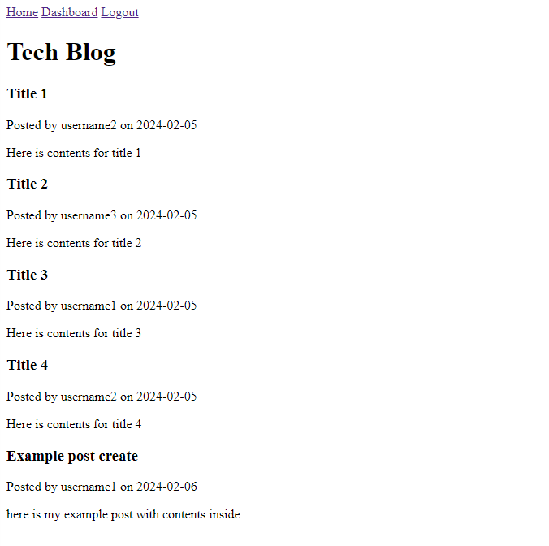

# Tech Blog

## Description

An `express` backend with RESTful routes CRUD'ing data to a MySQL database via `sequelize`, with `handlebars` handling the frontend for views.

## Table of Contents

- [Deployment](#deployment)
- [Example](#sample)

## Deployment

Deployed application: https://rbtech-blog-ebd1d90373e3.herokuapp.com/

## Screenshot

